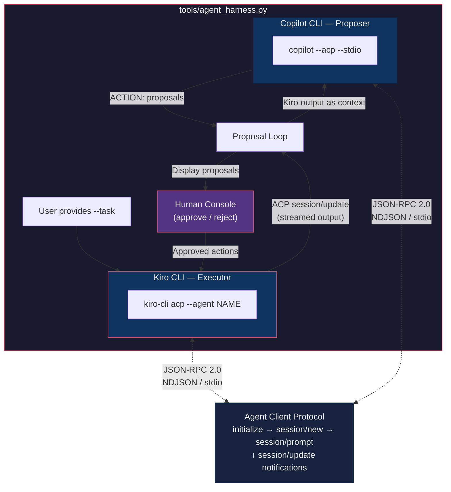

# ACOLITE-RS Roadmap

## Architecture

```
src/
├── auth/           # Secure credentials (.netrc, env vars, config)
│   └── credentials.rs
├── loader/         # INPUT: Read satellite data
│   ├── geotiff.rs  # GDAL-based GeoTIFF reader
│   ├── landsat.rs  # Landsat L1 scene loader
│   ├── sentinel2.rs # S2 SAFE JP2 loader + radiometric calibration
│   ├── pace.rs     # PACE OCI L1B NetCDF reader
│   └── source/     # Remote data access
│       ├── cmr.rs      # NASA CMR search (OBDAAC + LP DAAC)
│       ├── stac.rs     # STAC search
│       └── download.rs # Download (EarthData + AWS S3)
├── ac/             # PROCESSING: Atmospheric correction
│   ├── aerlut.rs   # Aerosol LUT reader (sensor-specific 6SV NetCDF)
│   ├── dsf.rs      # DSF: dark spectrum, AOT inversion, model selection, correction
│   ├── gas_lut.rs  # Gas transmittance (O₃, H₂O, CO₂, O₂ from LUTs + RSR)
│   ├── interp.rs   # N-dimensional regular grid interpolator
│   ├── calibration.rs, rayleigh.rs, gas.rs, lut.rs
├── writer/         # OUTPUT: Write results
│   ├── mod.rs      # Auto-dispatch: >50 bands → GeoZarr, ≤50 → COG
│   ├── cog.rs      # Cloud-Optimized GeoTIFF (multispectral/superspectral)
│   └── geozarr.rs  # GeoZarr V3 (hyperspectral)
├── core/           # Data types (band, metadata, projection)
├── sensors/        # Sensor definitions (landsat, sentinel2, sentinel3, pace)
└── (pipeline, parallel, resample, simd)
```

## Output Format Strategy

`write_auto()` selects format based on band count:

| Category | Bands | Format | Rationale |
|----------|-------|--------|-----------|
| Hyperspectral | >50 | GeoZarr | 3D chunked array, efficient for 100s of bands |
| Superspectral | 16–50 | per-band COG | Widely compatible, manageable file count |
| Multispectral | ≤15 | per-band COG | Standard GIS workflow |

## Sensor Audit — Band Count Classification

### Hyperspectral (>50 bands) → GeoZarr

| Sensor | Bands | Status |
|--------|-------|--------|
| Tanager | 420 | Not started |
| PACE OCI | 286 | ✅ Full DSF pipeline + LUT gas transmittance + full-scene validated |
| EMIT | 285 | Not started |
| HYPERION | 242 | Not started |
| PRISMA | 239 | Not started |
| DESIS | 235 | Not started |
| EnMAP | 224 | Not started |
| HyperField | 150 | Not started |
| HICO | 128 | Not started |
| HYPSO | 120 | Not started |
| CHRIS | 62 | Not started |

### Superspectral (16–50 bands) → per-band COG

| Sensor | Bands | Status |
|--------|-------|--------|
| Aqua/Terra MODIS | 36 | Not started |
| WorldView-3 | 29 | Not started |
| VIIRS (NPP/J1/J2) | 22 | Not started |
| Sentinel-3 OLCI | 21 | Sensor def exists |
| AMAZONIA-1 WFI | 18 | Not started |
| GOES ABI | 16 | Not started |
| Himawari AHI | 16 | Not started |
| MTG-I FCI | 16 | Not started |

### Multispectral (≤15 bands) → per-band COG

| Sensor | Bands | Status |
|--------|-------|--------|
| ENVISAT MERIS | 15 | Not started |
| Sentinel-2 MSI | 13 | ✅ Full LUT-DSF pipeline |
| GOCI-2 | 12 | Not started |
| SEVIRI | 12 | Not started |
| Sentinel-3 SLSTR | 11 | Not started |
| Landsat 8/9 OLI | 9 | ✅ Full LUT-DSF pipeline |
| Landsat 7 ETM+ | 8 | Not started |
| PlanetScope SD8 | 8 | Not started |
| Landsat 5 TM | 7 | Not started |
| WorldView-2 | 6–8 | Not started |
| Pléiades | 5–7 | Not started |
| QuickBird-2 | 5 | Not started |

### Priority for Rust Port

1. **Landsat 8/9** — ✅ Full LUT-DSF pipeline, validated
2. **Sentinel-2 MSI** — ✅ Full LUT-DSF pipeline, physics-equivalent (RMSE < 0.002)
3. **PACE OCI** — ✅ Full generic-LUT DSF pipeline with LUT-based gas transmittance
4. **Sentinel-3 OLCI** — Sensor def exists, needs NetCDF loader
5. **PRISMA/DESIS/EnMAP** — Share HDF5 loader pattern
6. **EMIT** — NetCDF, similar to PACE

## Regression Testing

Full regression strategy is documented in [REGRESSION_TESTING_ROADMAP.md](REGRESSION_TESTING_ROADMAP.md).

### Rust Tests

| Suite | Tests | Command |
|-------|-------|---------|
| Unit tests | 26 | `cargo test --features full-io` |
| Integration tests | 8 | `cargo test --test integration_tests` |
| E2E tests | 14 (+1 pre-existing failure) | `cargo test --features full-io` |

### Python ↔ Rust Regression Tests (141 total)

| Test file | Sensor | Tests | Command |
|-----------|--------|-------|---------|
| test_landsat_regression.py | Landsat 8/9 | 13 | `pytest tests/regression/test_landsat_regression.py -v` |
| test_landsat_rust_vs_python.py | Landsat 8/9 | 13 | `pytest tests/regression/test_landsat_rust_vs_python.py -v -s` |
| test_benchmark_rust_vs_python.py | Landsat 8/9 | 7 | `pytest tests/regression/test_benchmark_rust_vs_python.py -v -s` |
| test_sentinel2_regression.py | Sentinel-2 | 19 | `pytest tests/regression/test_sentinel2_regression.py -v` |
| test_s2_rust_vs_python.py | Sentinel-2 | 15 | `pytest tests/regression/test_s2_rust_vs_python.py -v -s` |
| test_s2_benchmark_rust_vs_python.py | Sentinel-2 | 9 | `pytest tests/regression/test_s2_benchmark_rust_vs_python.py -v -s` |
| test_pace_regression.py | PACE OCI | 17 | `pytest tests/regression/test_pace_regression.py -v` |
| test_pace_rust_vs_python.py | PACE OCI | 14 | `pytest tests/regression/test_pace_rust_vs_python.py -v -s` |
| test_pace_dsf_rust_vs_python.py | PACE OCI (Chesapeake) | 12 | `pytest tests/regression/test_pace_dsf_rust_vs_python.py -v` |
| test_pace_sa_dsf_rust_vs_python.py | PACE OCI (SA ROI) | 12 | `pytest tests/regression/test_pace_sa_dsf_rust_vs_python.py -v` |
| test_pace_sa_fullscene_benchmark.py | PACE OCI (SA full scene) | 10 | `pytest tests/regression/test_pace_sa_fullscene_benchmark.py -v -s` |
| conftest.py | — | — | Shared pytest config, tolerances, CLI options |

### Performance Benchmarks

| Sensor | Scene | Rust | Python | Speedup | Notes |
|--------|-------|------|--------|---------|-------|
| Landsat 8 | Full scene (62M px × 7 bands) | 66s | 180s | 2.7× | |
| Landsat 9 | Full scene (62M px × 7 bands) | 56s | 180s | 3.2× | |
| Sentinel-2 A | Full scene (30M px × 11 bands) | 52s | 182s | **3.5×** | |
| Sentinel-2 B | Full scene (30M px × 11 bands) | 64s | 173s | 2.7× | |
| PACE OCI | ROI 108×57 (fixed) | 22s | 145s | 6.8× | |
| PACE OCI | Full 1710×1272 (fixed) | **84s** | 230s | **2.7×** | Load=12s, AC=34s, Write=35s |

**Optimizations applied:**
- PACE: Bulk NetCDF reads (3 detector reads vs 291 per-band) + rayon parallel AC
- All sensors: rayon parallel band correction
- Accuracy: Mean R≥0.999 across all sensors, 100% pixels within 0.05

### Quick Commands

```bash
# All Rust tests
cargo test --features full-io

# All Python regression (Tier 1+2, no real data)
pytest tests/regression/ -v

# Sentinel-2 fixed-mode regression (requires cached S2 data)
pytest tests/regression/test_s2_rust_vs_python.py -v -s

# Full regression with real data
pytest tests/regression/ -v --runslow \
  --pace-file /path/to/PACE_OCI.L1B.nc \
  --landsat-file /path/to/LC08_L1TP_... \
  --s2-file /path/to/S2A_MSIL1C_....SAFE
```

## Current State

- **48 Rust tests** (26 unit + 8 integration + 14 e2e)
- **141 Python regression tests**
- **6 examples** (Landsat, Landsat AWS, PACE, Sentinel-2, Sentinel-2 AC, Sentinel-3)
- **Clean architecture**: loader → ac → writer
- **Dual output**: GeoZarr (hyperspectral) + COG (multi/superspectral)
- **Physics-equivalent**: S2 RMSE < 0.002, Landsat RMSE < 0.02, PACE full-scene R=1.0000
- **No unwrap() in library code** (all replaced with proper error propagation)
- **PACE full-scene validated**: 1710×1272 × 291 bands, Mean RMSE=0.004, 100% within 0.05

## Porting Methodology — Multi-Agent Orchestration

The Rust port uses an AI-assisted workflow where two coding agents collaborate
via the [Agent Client Protocol (ACP)](https://agentclientprotocol.com/):



**Data flow:**
1. User sends `--task` → Orchestrator → Kiro (ACP prompt)
2. Kiro streams output ← `session/update` chunks
3. Kiro output → Copilot (ACP prompt for review)
4. Copilot proposes `ACTION:` lines
5. Human approves → approved actions → Kiro
6. Repeat 2–5 until `DONE` or max cycles

### Workflow per Sensor

```bash
# Example: port a new sensor loader
python tools/agent_harness.py \
    --task "Port acolite/sentinel3/ to src/loader/sentinel3.rs following the
            Landsat and Sentinel-2 patterns. Read JP2/NetCDF bands, parse
            geometry XML, and produce BandData arrays." \
    --kiro-agent rust-developer \
    --workdir /path/to/acolite

# Example: fix regression failures
python tools/agent_harness.py \
    --task "The Sentinel-3 OLCI regression test has RMSE=0.05.
            Investigate gas transmittance differences and fix." \
    --auto-approve
```

### Agent Roles

| Agent | CLI | Role | ACP Launch |
|-------|-----|------|------------|
| **Kiro** | `kiro-cli acp` | Executor — writes code, runs tests, reads files | `kiro-cli acp --agent rust-developer` |
| **Copilot** | `copilot --acp --stdio` | Proposer — reviews progress, suggests next steps | `copilot --acp --stdio` |
| **Human** | terminal | Approver — filters proposals before dispatch | Interactive prompt |

### Protocol Details

Both agents speak ACP (JSON-RPC 2.0 over NDJSON stdio):

- **`initialize`** — negotiate capabilities (Kiro: `protocolVersion: 1`, Copilot: `"2025-07-09"`)
- **`session/new`** — create a workspace-scoped session with `cwd`
- **`session/prompt`** — send a user message (Kiro uses `content` field, Copilot uses `prompt` field)
- **`session/update`** — streamed notifications: `agent_message_chunk`, `tool_call`, `turn_end`
- **`session/cancel`** — interrupt processing

### When to Use the Harness

- **New sensor port**: Kiro writes the loader + example + tests, Copilot cross-checks against Python source
- **Regression debugging**: Kiro investigates numerical differences, Copilot proposes diagnostic steps
- **Bulk porting**: Chain multiple `--task` invocations for loader → AC → writer per sensor
- **Code review**: Copilot can review Kiro's output against project conventions (`.github/copilot-instructions.md`)

### Files

- **`tools/agent_harness.py`** — Orchestrator script (652 lines)
- **`.github/copilot-instructions.md`** — Project conventions fed to both agents
- **`.github/skills/rust-porting/SKILL.md`** — Porting knowledge base
- **`.github/skills/regression-testing/SKILL.md`** — Test writing knowledge base

## Completed ✅

### Phase A: Architecture
- [x] Loader → AC → Writer restructure
- [x] Secure credentials (zeroize, .netrc, env vars)
- [x] Single search/download/reader implementations
- [x] PACE OCI L1B NetCDF reader
- [x] OBDAAC CMR search (collection_id based)
- [x] GeoZarr writer (zarrs crate, Zarr V3, gzip, CF metadata)
- [x] Auto-dispatch writer (>50 bands → GeoZarr, ≤50 → COG)
- [x] f32 pipeline path for pre-calibrated sensors (PACE)

### Phase B: Real Atmospheric Correction
- [x] LUT loading — sensor-specific 6SV NetCDF LUTs, multi-pressure stacking
- [x] N-dimensional interpolation (RegularGridInterpolator equivalent)
- [x] Gas transmittance — O₃/H₂O/CO₂/O₂ from ko3 data + RSR convolution
- [x] DSF algorithm — dark spectrum extraction (intercept method), AOT inversion, model selection
- [x] Tiled DSF — 200×200 tile grid, per-tile AOT, most-common model voting
- [x] Fixed DSF — whole-scene dark spectrum, single AOT
- [x] Surface reflectance correction — `rhos = (rhot/tt_gas - romix) / (dutott + astot*(rhot/tt_gas - romix))`
- [x] Multi-model selection — MOD1 (Continental) + MOD2 (Maritime), min RMSD

### Phase C: Validation
- [x] Landsat 8/9 Rust vs Python — R>0.998, RMSE<0.02
- [x] Sentinel-2 A/B Rust vs Python — R=1.000, RMSE<0.002 (physics-equivalent)
- [x] PACE OCI Rust vs Python — r=0.9995

### Phase E: Production Hardening (partial)
- [x] Remove all `unwrap()` from library code (proper error propagation)
- [x] S2 RADIO_ADD_OFFSET support (processing baseline ≥ 4.0)
- [x] CLI args: `--model auto|MOD1|MOD2`, `--aot-mode tiled|fixed`

## Next Steps

### Phase D — Additional Loaders
- [ ] Sentinel-3 OLCI (NetCDF) — sensor def exists, needs full pipeline
- [ ] PRISMA/DESIS/EnMAP (HDF5)
- [ ] EMIT (NetCDF)

### Phase E — Production Hardening (remaining)
- [ ] ROI subsetting (limit parameter)
- [ ] Interface reflectance (rsky)
- [ ] Ancillary data (NCEP ozone/pressure/wind)
- [ ] DEM-derived pressure
- [ ] Glint correction
- [ ] Streaming processing for large scenes
- [ ] CLI matching Python ACOLITE settings files
- [ ] NetCDF L2R output matching Python format

### Phase F — Water Products (L2W)
- [ ] Port `acolite_l2w.py` parameter computation
- [ ] Chlorophyll-a (OC algorithms)
- [ ] TSS (Nechad, Dogliotti)
- [ ] Turbidity

## Dependencies

```toml
gdal = "0.17"        # GeoTIFF/JP2 read/write
ndarray = "0.15"     # Array processing
rayon = "1.8"        # Parallelism
zarrs = "0.23"       # Zarr V3 (GeoZarr output)
tiff = "0.9"         # Fallback TIFF writing
reqwest = "0.11"     # HTTP
serde = "1.0"        # Serialization
chrono = "0.4"       # DateTime
thiserror = "1.0"    # Error types
zeroize = "1.8"      # Credential security
netcdf = "0.9"       # LUT/PACE/S3 NetCDF (optional, full-io feature)
```
